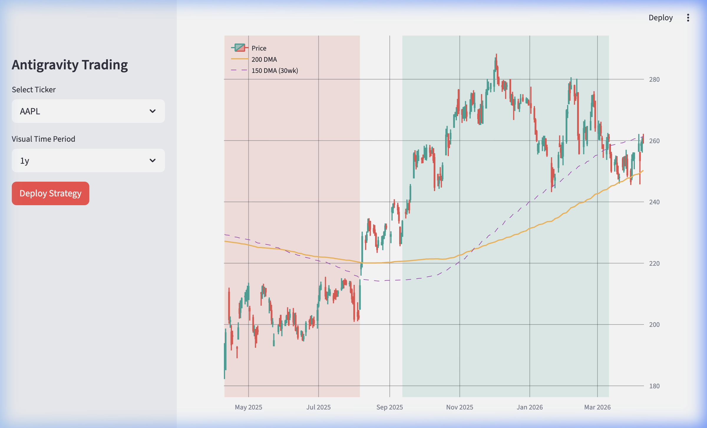

# Antigravity Trading Sandbox: Stan Weinstein Stage Analysis

This repository is a fully interactive algorithmic trading dashboard built using **Streamlit** and **Plotly**.

It features live market data ingestion via `yfinance` and algorithmically applies **Stan Weinstein's Stage Analysis** natively onto the charts.

## Features
- 📈 Fully interactive, dark-mode Plotly candlestick charts.
- 📅 Dropdown support for various historical periods and popular tickers (AAPL, NVDA, SPY, etc.)
- 🟣 **150-Day Moving Average** overlay representing the core 30-week base trend.
- 🟠 **200-Day Moving Average** overlay for macro trend confirmation.
- 🟢 **Stage 2 Shading**: Mathematically identifies and highlights active advancing phases (Close > 150-DMA combined with a structurally positive 20-day slope).
- 🔴 **Stage 4 Shading**: Mathematically identifies and highlights active declining phases (Close < 150-DMA combined with a structurally negative 20-day slope).

## Demo


## Local Setup
```bash
# Resolve and sync dependencies automatically via uv
uv sync

# Run the Streamlit dashboard natively (spawns on localhost:8501)
uv run streamlit run main.py
```
